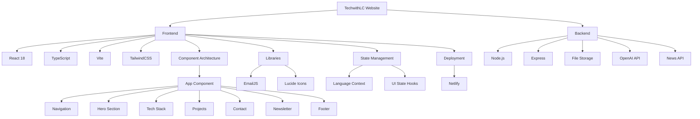

# TechwithLC Personal Website

A modern, responsive personal website showcasing tech content creation, cloud computing expertise, and professional portfolio.

## 🚀 Features

- **Bilingual Support** - Full English/Chinese language switching
- **Responsive Design** - Mobile-first approach with adaptive layouts
- **Interactive UI** - Smooth animations, transitions, and hover effects
- **Content Integration** - Embedded Spotify podcasts, YouTube videos, and Medium articles
- **Contact System** - EmailJS integration for feedback without a backend
- **Dynamic Elements** - Scroll-to-top, social sharing, and feedback modal
- **RSS News Feed** - AI news summarization delivered via RSS feed
  - **Mobile-Friendly** - QR code for easy mobile subscription
  - **Serverless Compatible** - Automated updates via GitHub Actions

## 🛠️ Tech Stack



## 📦 Project Structure

- `src/` - Source code
  - `App.tsx` - Main application component
  - `main.tsx` - Application entry point
  - `contexts/` - React contexts (Language)
  - `config/` - Configuration files
- `public/` - Static assets
- `server/` - Backend services
  - `index.js` - Express server setup
  - `routes/` - API endpoints
  - `services/` - Business logic (news)
  - `.env.example` - Environment variables template
- `dist/` - Build output

## 🔧 Development

```bash
# Install dependencies
npm install

# Start development server
npm run dev

# Build for production
npm run build

# Preview production build
npm run preview

# Start backend server
cd server
npm install
npm run dev
```

## 🔧 Backend Setup

1. Create a `.env` file in the server directory based on the `.env.example` template
2. Set up the required environment variables:
   - `OPENAI_API_KEY` - OpenAI API key for news summarization with GPT-4o
   - `NEWS_API_KEY` - News API key for fetching AI articles
3. Choose your deployment method:
   - **GitHub Actions**: Use the provided workflow file for scheduled RSS feed updates
   - **Serverless Deployment**: Deploy to Netlify or Vercel using the provided configurations

## 🚀 Production Deployment

### Frontend Deployment

The frontend is deployed on Netlify:

1. Build the frontend for production:
   ```bash
   npm run build
   ```

2. Deploy the `dist` directory to Netlify:
   - Connect your GitHub repository to Netlify
   - Set the build command to `npm run build`
   - Set the publish directory to `dist`

### Backend Deployment

Choose one of the following deployment options based on your needs:

1. **GitHub Actions Automation** (Recommended):
   - The included GitHub Actions workflow file will automatically:
     - Run every Monday at 9:00 AM UTC
     - Update the RSS feed with the latest AI news
     - Commit and push the updated feed to your repository

2. **Serverless Deployment (Netlify)**:
   ```bash
   # Install Netlify CLI
   npm install -g netlify-cli
   
   # Deploy to Netlify
   cd server
   netlify deploy --prod
   ```

3. **Serverless Deployment (Vercel)**:
   ```bash
   # Install Vercel CLI
   npm install -g vercel
   
   # Deploy to Vercel
   cd server
   vercel --prod
   ```

4. **RSS Feed Integration**:
   - RSS Feed URL: `https://yourdomain.com/api/feeds/rss`
   - Newsletter Subscription Page: `https://yourdomain.com/newsletter`
   - Mobile-friendly QR code included on subscription page

## 📱 Features Showcase

- **Tech Content Creation** - YouTube tutorials, podcast episodes, and Medium articles
- **Cloud Technology** - AWS, Azure, and GCP expertise
- **Professional Network** - GitHub, LinkedIn, and Twitter integration
- **Bilingual Content** - Supporting both English and Chinese audiences
- **AI Newsletter** - Weekly AI news summaries delivered via RSS feed

## 📞 Contact

- LinkedIn: [klunlawrencechen](https://www.linkedin.com/in/klunlawrencechen/)
- GitHub: [techwithlc](https://github.com/techwithlc)
- Twitter: [techwithlc0921](https://x.com/techwithlc0921)
- Email: kuanlunlawrence.chen@gmail.com

## 🌟 Recent Updates

- Added scroll-to-top button with animation
- Fixed footer area
- Added X (Twitter) to contact area
- Fixed button errors
- Implemented RSS feed for AI news updates
- Integrated OpenAI's GPT-4o for AI news summarization
- Created GitHub Actions workflow for automated RSS feed updates
- Added mobile-friendly subscription page with QR code
- Created serverless deployment configurations for Netlify and Vercel
- Added comprehensive deployment documentation for various hosting options