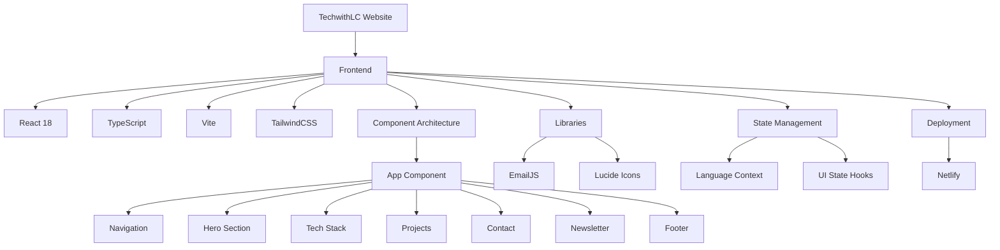

# TechwithLC Personal Website

A modern, responsive personal website showcasing tech content creation, cloud computing expertise, and professional portfolio.

## 🚀 Features

- **Bilingual Support** - Full English/Chinese language switching
- **Responsive Design** - Mobile-first approach with adaptive layouts
- **Interactive UI** - Smooth animations, transitions, and hover effects
- **Content Integration** - Embedded Spotify podcasts, YouTube videos, and Medium articles
- **Contact System** - EmailJS integration for feedback without a backend
- **Dynamic Elements** - Scroll-to-top, social sharing, and feedback modal
- **Newsletter Signup** - Email collection form for content updates

## 🛠️ Tech Stack



## 📦 Project Structure

- `src/` - Source code
  - `App.tsx` - Main application component
  - `main.tsx` - Application entry point
  - `contexts/` - React contexts (Language)
  - `config/` - Configuration files
- `public/` - Static assets
- `dist/` - Build output

## 🔧 Development

```bash
# Install dependencies
npm install

# Start development server
npm run dev

# Build for production
npm run build

# Preview production build
npm run preview
```

## 📱 Features Showcase

- **Tech Content Creation** - YouTube tutorials, podcast episodes, and Medium articles
- **Cloud Technology** - AWS, Azure, and GCP expertise
- **Professional Network** - GitHub, LinkedIn, and Twitter integration
- **Bilingual Content** - Supporting both English and Chinese audiences

## 📞 Contact

- LinkedIn: [klunlawrencechen](https://www.linkedin.com/in/klunlawrencechen/)
- GitHub: [techwithlc](https://github.com/techwithlc)
- Twitter: [techwithlc0921](https://x.com/techwithlc0921)
- Email: kuanlunlawrence.chen@gmail.com

## 🌟 Recent Updates

- Added scroll-to-top button with animation
- Fixed footer area
- Added X (Twitter) to contact area
- Fixed button errors